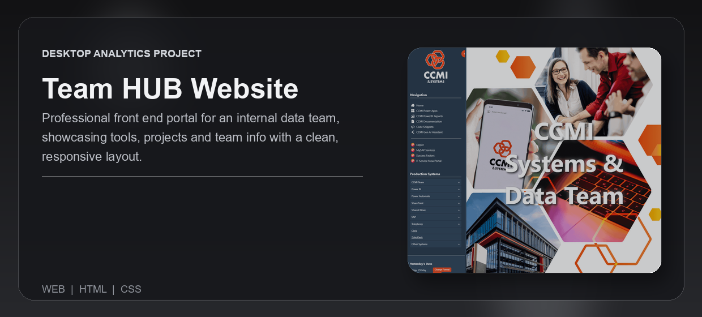
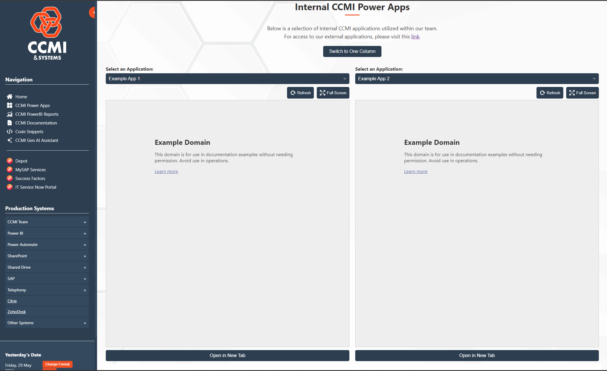
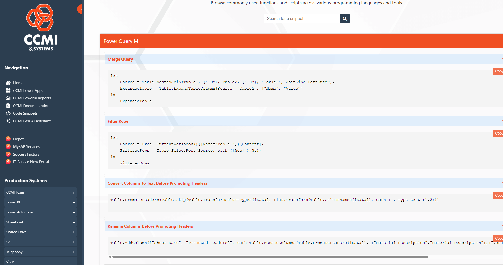
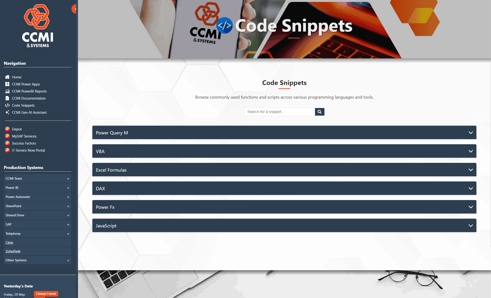

---
<div align="center">


<br /><br />

<p><strong>Professional front end portal for an internal data team, showcasing tools, projects and team info with a clean, responsive layout.</strong></p>

<p>Built for an internal data team to centralise Power Apps, Power BI reports, documentation, code snippets, and system shortcuts in one reliable hub.</p>

<p>
  <a href="#overview">Overview</a> |
  <a href="#what-problem-it-solves">What It Solves</a> |
  <a href="#feature-highlights">Features</a> |
  <a href="#screenshots">Screenshots</a> |
  <a href="#quick-start">Quick Start</a> |
  <a href="#tech-stack">Tech Stack</a>
</p>

<h3><strong>Made by Naadir | May 2026</strong></h3>

</div>

---

## Overview

Team Hub Website is a multi-page internal portal that brings the team’s core tools into one front end. It embeds Microsoft Power Apps and Power BI reports directly inside the site using iframes, so users can open apps, view reports, access documentation, and find key resources without jumping between separate bookmarks and systems.

The Power Apps page lets users view all team apps from one place, switch between them with a dropdown, and open them in full-screen mode when they need more working space. The Power BI reports page gives the team a central reporting view, while the documentation and code snippets pages keep operational knowledge and proprietary team code easy to find.

The practical result is a faster daily workflow. The team gets one controlled hub for apps, reports, documentation, snippets, and shortcut links instead of relying on scattered links, manual searching, or shared messages.

## What Problem It Solves

- Removes scattered bookmarks, links, and repeated searching across team systems
- Replaces manual navigation between Power Apps, Power BI, documentation, and code references
- Makes team tools, reports, snippets, and operational knowledge easier to find from one interface
- Gives the team a cleaner default workspace than opening separate browser tabs for every system

### At a glance

| Track | Analyse | Compare |
|---|---|---|
| Team apps, reports, documentation, code snippets, and system links | Embedded Power BI reports and team resource usage flows | Power Apps and reports across different team areas |
| Selected app, selected report, active page, and shortcut target | Report views, app access patterns, and navigation paths | Standard browser navigation vs central team portal |
| Open, switch, full-screen, read, copy, and launch workflows | Embedded reports, documentation pages, and snippet libraries | Faster access vs scattered manual lookup |

## Feature Highlights

- **Power Apps hub**, switch between embedded apps with a dropdown and open them full screen when focused work is needed
- **Power BI reports page**, view key team reports from one central reporting area without hunting for separate links
- **Documentation page**, keep team guidance and process notes available inside the same portal as the tools
- **Code snippets page**, store proprietary team snippets in one searchable reference area for faster reuse
- **System shortcuts**, launch all frequently used team systems from one clean set of links
- **Multi-page front end**, separate apps, reports, documentation, snippets, and shortcuts into clear working areas

### Core capabilities

| Area | What it gives you |
|---|---|
| **Embedded tools** | Direct access to Microsoft Power Apps and Power BI reports inside the website |
| **Navigation** | Clear pages and shortcut links for the systems the team uses every day |
| **Knowledge base** | Central documentation and proprietary snippets without separate files or message threads |
| **Focused usage** | Dropdown switching and full-screen app views for faster hands-on work |

## Screenshots

<details>
<summary><strong>Open screenshot gallery</strong></summary>

<br />

<div align="center">
  
  <br /><br />
  
  <br /><br />
  
</div>

</details>

## Quick Start

```bash
# Clone the repo
git clone https://github.com/Naadir-Dev-Portfolio/Team-Hub-Website.git
cd Team-Hub-Website

# Install dependencies
echo "No dependencies required"

# Run
python -m http.server 8000
```

Open `http://localhost:8000` in the browser. No API keys are required. Microsoft Power Apps and Power BI embeds require valid organisation access, permissions, and sign-in where required.

## Tech Stack

<details>
<summary><strong>Open tech stack</strong></summary>

<br />

| Category | Tools |
|---|---|
| **Primary stack** | `JavaScript` | `HTML` | `CSS` | `VBScript` |
| **UI / App layer** | Multi-page static web interface with embedded iframe views |
| **Data / Storage** | Static pages, local project files, embedded Microsoft Power Apps links, embedded Power BI report links |
| **Automation / Integration** | Microsoft Power Apps embeds, Power BI report embeds, internal system shortcut links, local front end scripts |
| **Platform** | Web |

</details>

## Architecture & Data

<details>
<summary><strong>Open architecture and data details</strong></summary>

<br />

### Application model

The site works as a static front end around internal Microsoft and team resources. Users open the portal, choose a page, then either launch a shortcut, view an embedded Power App, open an embedded Power BI report, read documentation, or copy a stored code snippet. JavaScript handles page interactions such as dropdown switching, iframe source changes, and full-screen controls. HTML defines the page structure, CSS controls the responsive layout, and iframe embeds expose the external Microsoft tools inside the portal.

### Project structure

```text
Team-Hub-Website/
+-- index.html
+-- assets/
+-- README.md
+-- repo-card.png
+-- portfolio/
    +-- team-hub-website.json
    +-- team-hub-website.webp
    +-- Screen1.png
    +-- Screen2.png
    +-- Screen3.png
```

### Data / system notes

- Embedded Power Apps and Power BI reports depend on valid iframe URLs and user permissions inside the Microsoft tenant
- The portal is a front end hub and does not store report data, app data, or credentials locally
- The project can run locally as a static site and can be deployed to any standard web hosting environment that supports HTML, CSS, and JavaScript

</details>

## Contact

Questions, feedback, or collaboration: `naadir.dev.mail@gmail.com`

<sub>JavaScript | HTML | CSS | VBScript</sub>
